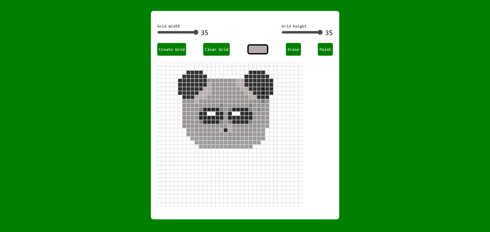

# 🎨 Pixel Art Generator

It is a web-based Pixel Art Generator built using HTML, CSS, and JavaScript. This application allows users to create pixel artwork by painting cells on a customizable grid.
### Features:
- Generate custom-sized pixel grids
- Paint cells using a color picker
- Erase painted pixels
- Clear the entire grid with one click
- Interactive and easy-to-use interface
### Technologies Used:
- HTML
- CSS
- JavaScript
### What I Learned:
- DOM Manipulation
- Event Handling
- CSS Grid Layout
- JavaScript Functions
- Dynamic Element Creation
- User Interaction Design
### How to Use:
- Select the desired grid width and height.
- Click Create Grid.
- Choose a color.
- Click or drag on cells to paint.
- Use Erase to remove colors.
- Use Clear Grid to reset the canvas.
### Screenshot:

